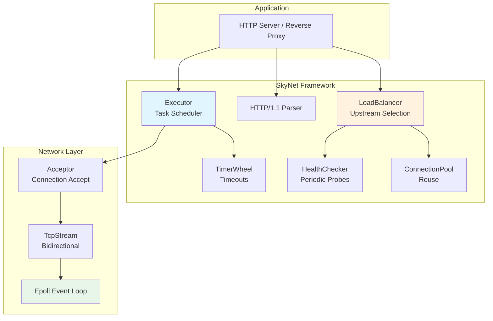
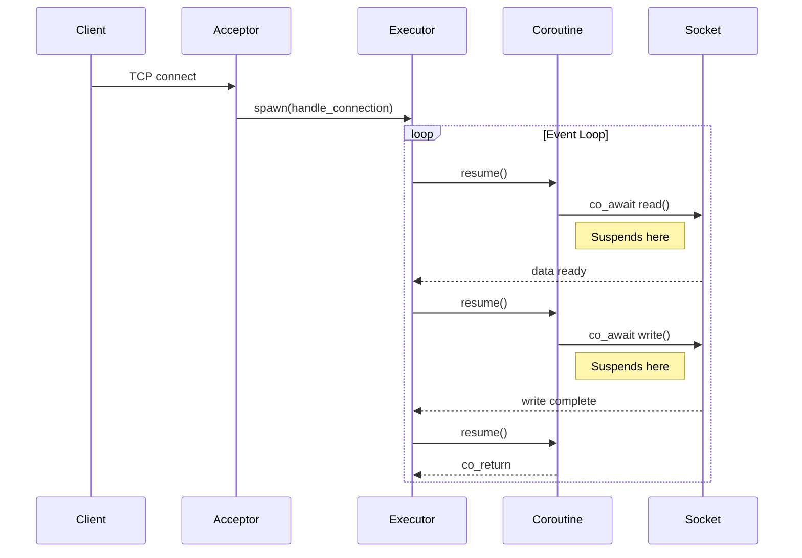
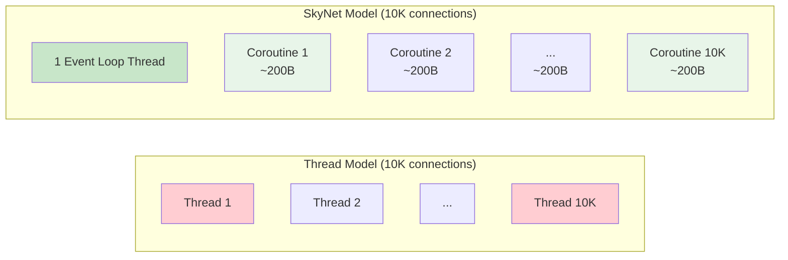
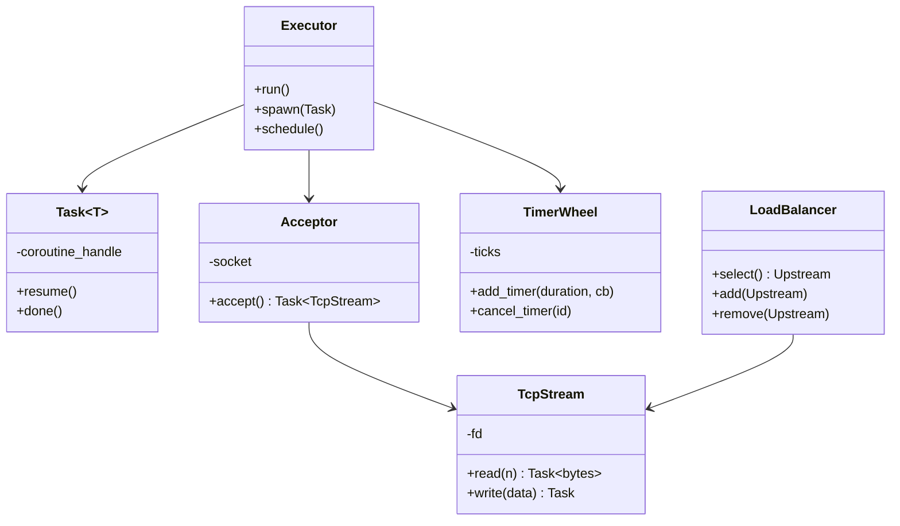

<p align="center">
  
  
  
  
  
</p>

<h1 align="center">🌐 SkyNet</h1>

<p align="center">
  <b>C++20 Coroutine Network Framework &amp; HTTP Reverse Proxy</b><br/>
  <i>Zero-cost abstractions · Event-driven · Production-grade</i>
</p>

---

## Overview

SkyNet is a **modern C++20 network framework** built on coroutines. It provides a high-level async I/O model where you write sequential-looking code that executes concurrently — like Go's goroutines but with C++'s zero-cost abstractions.

### Architecture



---

## Coroutine Flow



---

## Coroutine vs Thread



| | Thread-per-connection | SkyNet Coroutines |
|---|---|---|
| 10K connections | 10K threads (crash) | 1 thread (smooth) |
| Memory per connection | ~1MB stack | ~200 bytes frame |
| Context switch | OS kernel (expensive) | User-space (cheap) |
| Blocking I/O | Thread stalls | Coroutine suspends |

---

## Quick Start

```bash
# Clone
git clone https://github.com/Thezx-a/SkyNet.git
cd SkyNet

# Build & Test
cmake -B build -G Ninja -DCMAKE_BUILD_TYPE=Release \
  -DENABLE_TESTS=ON -DCMAKE_CXX_COMPILER=g++-12
cmake --build build -j$(nproc)
ctest --test-dir build --output-on-failure
```

### Basic Coroutine Example

```cpp
#include <skynet/executor.h>
#include <skynet/task.h>
#include <skynet/tcp_socket.h>

skynet::Task<int> handle_client(skynet::TcpStream stream) {
    auto data = co_await stream.read(1024);  // pause until data arrives
    co_await stream.write("Hello!\n");       // pause until sent
    co_return 0;
}

int main() {
    skynet::Executor executor;
    skynet::Acceptor acceptor(executor, 8080);
    while (auto conn = co_await acceptor.accept()) {
        executor.spawn(handle_client(std::move(*conn)));
    }
}
```

---

## Component Map



---

## Project Structure

```
SkyNet/
├── include/skynet/          Public API headers
│   ├── task.h               Coroutine Task type
│   ├── executor.h           Event loop & task scheduler
│   ├── tcp_socket.h         Coroutine TCP socket
│   ├── acceptor.h           Connection acceptor
│   ├── tcp_stream.h         Bidirectional TCP stream
│   ├── timer_wheel.h        Timer management
│   ├── upstream.h           Load balancer
│   └── http_parser.h        HTTP/1.1 parser
├── src/
│   ├── core/                Scheduler internals
│   ├── net/                 TCP layer
│   ├── http/                HTTP parser
│   └── proxy/               Reverse proxy logic
├── gateway/                 Gateway application
├── examples/                Example programs
├── tests/                   9 unit tests
└── docker/                  Docker deployment
```

---

## Tests

| Module | Tests | What's Verified |
|--------|-------|-----------------|
| Task | 2 | Basic await, exception propagation |
| Executor | 2 | Spawn, concurrent execution |
| TimerWheel | 2 | Add/remove, expiry |
| Upstream | 3 | Selection, health checks, removal |

---

## Use as a Library

```cmake
add_subdirectory(path/to/SkyNet)
target_link_libraries(your_app skynet)
```

---

## Tech Stack

`C++20` `Coroutines` `CMake` `Ninja` `Epoll` `Google Test` `Docker`

---

## License

[MIT](LICENSE)
